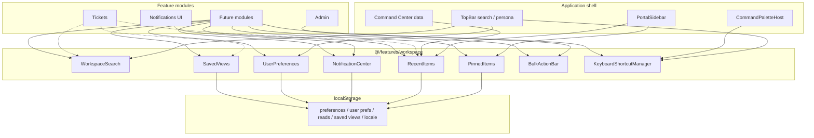

# Phase 3.5 — Service Diagram

**Date:** 2026-07-28

```mermaid
flowchart TB
  subgraph Shell["Application shell"]
    TopBar["TopBar search / persona"]
    Sidebar["PortalSidebar"]
    Palette["CommandPaletteHost"]
    CC["Command Center data"]
  end

  subgraph Modules["Feature modules"]
    Tickets["Tickets"]
    Admin["Admin"]
    NotifUI["Notifications UI"]
    Future["Future modules"]
  end

  subgraph Platform["@/features/workspace"]
    WS["WorkspaceSearch"]
    SV["SavedViews"]
    RI["RecentItems"]
    PI["PinnedItems"]
    NC["NotificationCenter"]
    UP["UserPreferences"]
    BAB["BulkActionBar"]
    KSM["KeyboardShortcutManager"]
  end

  subgraph Storage["localStorage"]
    KP["preferences / user prefs / reads / saved views / locale"]
  end

  TopBar --> WS
  TopBar --> KSM
  TopBar --> UP
  Palette --> KSM
  Sidebar --> PI
  Sidebar --> RI
  CC --> RI
  Tickets -.-> WS
  Tickets -.-> SV
  Tickets -.-> RI
  Admin --> BAB
  NotifUI --> NC
  Future --> WS
  Future --> SV
  Future --> RI
  Future --> PI
  Future --> NC
  Future --> UP
  Future --> BAB
  Future --> KSM

  PI --> KP
  RI --> KP
  NC --> KP
  UP --> KP
  SV --> KP
```

Solid lines = wired in Phase 3.5. Dotted = contract ready for next strangler waves.
