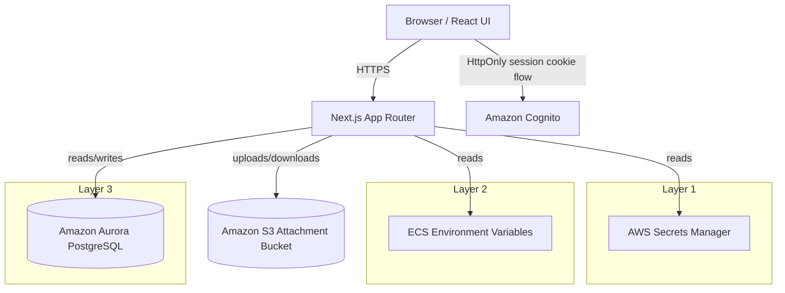

# Enterprise Configuration Architecture

## Status

This document defines the target architecture for the Nexus Support Portal after the browser-storage cleanup.

Verified current code state:

- Platform secrets are resolved server-side.
- Browser-local config persistence has been removed from the portal shell.
- MSAL cache has been moved off browser storage.
- Notification read-state remains in browser localStorage as allowed.

Current implementation gap:

- Attachment file content is still represented in the ticket model and Jira attachment helpers, so S3-backed object storage still needs to be implemented end-to-end.

## Architecture Diagram

## Configuration Matrix

| Layer | Source | Stored Where | Editable From UI | Examples |
| --- | --- | --- | --- | --- |
| Platform Secrets | AWS Secrets Manager | Server memory only | No | Jira token, GitLab token, OpenAI API key, SMTP password, Microsoft Graph secret, Cognito secret, Aurora password |
| Platform Environment Configuration | ECS environment variables | ECS task definition | No | Jira URL, Jira project, GitLab URL, OpenAI model, SMTP host/port/username, Cognito region/user pool/client ID, Aurora host/db name, S3 bucket name, AWS region |
| Business Configuration | Aurora PostgreSQL | Aurora tables | Yes | ticket defaults, categories, priorities, workflow, SLA, branding, dashboard config, widgets, email templates, notification rules, feature flags, UI config |

## Environment Variables

### ECS Environment Variables

- `NEXT_PUBLIC_NEXUS_AUTH_MODE`
- `NEXT_PUBLIC_NEXUS_APP_URL`
- `NEXT_PUBLIC_COGNITO_DOMAIN`
- `NEXT_PUBLIC_COGNITO_CLIENT_ID`
- `NEXT_PUBLIC_COGNITO_USER_POOL_ID`
- `NEXT_PUBLIC_COGNITO_REGION`
- `NEXT_PUBLIC_COGNITO_IDP_NAME`
- `NEXT_PUBLIC_MICROSOFT_GRAPH_CLIENT_ID`
- `NEXT_PUBLIC_MICROSOFT_GRAPH_TENANT_ID`
- `NEXT_PUBLIC_MICROSOFT_GRAPH_REDIRECT_URI`
- `OPENAI_MODEL`
- `GRAPH_ORGANIZER_EMAIL`
- `GRAPH_CALENDAR_MAILBOX`
- `AWS_REGION`
- `AURORA_HOST`
- `AURORA_DATABASE_NAME`
- `JIRA_URL`
- `JIRA_PROJECT`
- `GITLAB_URL`
- `SMTP_HOST`
- `SMTP_PORT`
- `SMTP_USERNAME`
- `COGNITO_REGION`
- `COGNITO_USER_POOL_ID`
- `COGNITO_CLIENT_ID`
- `S3_BUCKET_NAME`

### Browser-Visible Public Env Values

These are allowed only because they are non-secret identifiers or URLs:

- `NEXT_PUBLIC_NEXUS_AUTH_MODE`
- `NEXT_PUBLIC_NEXUS_APP_URL`
- `NEXT_PUBLIC_COGNITO_DOMAIN`
- `NEXT_PUBLIC_COGNITO_CLIENT_ID`
- `NEXT_PUBLIC_COGNITO_USER_POOL_ID`
- `NEXT_PUBLIC_COGNITO_REGION`
- `NEXT_PUBLIC_COGNITO_IDP_NAME`
- `NEXT_PUBLIC_MICROSOFT_GRAPH_CLIENT_ID`
- `NEXT_PUBLIC_MICROSOFT_GRAPH_TENANT_ID`
- `NEXT_PUBLIC_MICROSOFT_GRAPH_REDIRECT_URI`

## AWS Secrets

Store in AWS Secrets Manager only:

- `JIRA_TOKEN`
- `GITLAB_TOKEN`
- `OPENAI_API_KEY`
- `SMTP_PASSWORD`
- `MICROSOFT_GRAPH_SECRET`
- `COGNITO_SECRET`
- `AURORA_MASTER_SECRET_JSON` or equivalent RDS master secret reference

## Aurora Schema Changes

### Business Configuration

Keep portal configuration in Aurora, not in browser storage.

Recommended tables:

- `app_config`
- `ticket_defaults`
- `workflow_templates`
- `sla_policies`
- `notification_rules`
- `feature_flags`
- `branding_settings`
- `dashboard_settings`
- `widget_settings`
- `email_templates`

### Attachment Metadata

Do not store file content in Aurora.

Attachment row should contain only metadata:

- `id`
- `ticket_id`
- `file_name`
- `size_bytes`
- `mime_type`
- `hash_sha256`
- `uploaded_by`
- `uploaded_at`
- `storage_provider`
- `bucket_name`
- `object_key`
- `preview_available`

Recommended removals from the metadata table:

- `local_path`

Recommended additions:

- `s3_etag`
- `content_disposition`
- `content_encoding`

## S3 Migration Plan

1. Create a dedicated private attachment bucket.
2. Enable block public access.
3. Enable SSE-KMS or SSE-S3.
4. Enable versioning.
5. Add lifecycle rules for stale versions and orphaned uploads.
6. Upload attachment bytes from the application to S3.
7. Persist only metadata in Aurora.
8. Generate signed download URLs or proxy downloads through the application.
9. Migrate existing attachment content from Aurora/local storage to S3.
10. Backfill attachment metadata rows with S3 bucket/key/hash.

## Terraform Changes

### Secrets

- Keep Secrets Manager resources for platform secrets only.
- Inject secret ARNs into ECS via container `secrets`.
- Do not expose secret values in `environment`.

### ECS

- Pass only non-secret deployment config via `environment`.
- Pass secret values via `secrets`.
- Remove any browser-persisted config assumptions from the container startup.
- Keep ALB WAF association enabled.
- Keep Cognito auth bootstrap configuration injected as non-secret env values.

### S3

- Add a new module for attachment storage.
- Add bucket policy for app task role access.
- Add KMS key policy if SSE-KMS is used.
- Add CloudTrail/S3 access logging if required by compliance.

### Aurora

- Continue using managed master password.
- Inject the master secret ARN into ECS.
- Keep host/database name as environment config.

## ECS Changes

- Runtime config:
  - `AURORA_HOST`
  - `AURORA_DATABASE_NAME`
  - `JIRA_URL`
  - `JIRA_PROJECT`
  - `GITLAB_URL`
  - `OPENAI_MODEL`
  - `SMTP_HOST`
  - `SMTP_PORT`
  - `SMTP_USERNAME`
  - `COGNITO_REGION`
  - `COGNITO_USER_POOL_ID`
  - `COGNITO_CLIENT_ID`
  - `S3_BUCKET_NAME`
  - `AWS_REGION`
- Secrets:
  - `AURORA_MASTER_SECRET_JSON`
  - `JIRA_TOKEN`
  - `GITLAB_TOKEN`
  - `OPENAI_API_KEY`
  - `SMTP_PASSWORD`
  - `MICROSOFT_GRAPH_SECRET`
  - `COGNITO_SECRET`

## Migration Checklist

1. Remove any browser fallback persistence for portal config.
2. Ensure MSAL uses memory-only cache.
3. Confirm only theme, locale, sidebar state, and notification read-state persist in browser.
4. Move attachment bytes to S3.
5. Store attachment metadata only in Aurora.
6. Remove any local file path dependency from attachment records.
7. Validate all platform secrets come from Secrets Manager.
8. Validate all deployment config comes from ECS environment variables.
9. Verify RBAC is enforced server-side.
10. Rebuild and redeploy ECS.

## Verification Checklist

- No platform secrets stored in browser.
- No platform secrets stored in Aurora.
- No platform secrets returned by API responses.
- Only allowed browser state remains persisted.
- Attachments uploaded to S3.
- Aurora stores only attachment metadata.
- Cognito login remains HttpOnly cookie based.
- RBAC checks remain server-side.
- Terraform injects environment config and secret ARNs correctly.

## Current Audit Result

- Browser secret exposure: pass.
- Browser config persistence: pass for the refactored browser paths.
- Platform secret storage: pass.
- Business config in Aurora: pass for the current config model.
- Attachment S3 storage: not yet complete.

